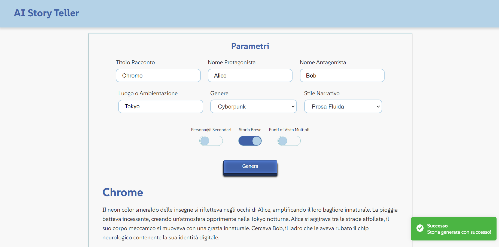

# AI Story Teller

AI Story Teller is an innovative application that generates creative stories based on user input. It allows users to customize their stories with various genres and narrative styles, and provides options for voice narration of the generated content.

## Table of Contents

- [Introduction](#introduction)
- [Features](#features)
- [Demo](#demo)
- [Technologies Used](#technologies-used)
- [Usage](#usage)
- [Contributing](#contributing)
- [License](#license)

## Introduction

AI Story Teller is designed to create engaging and imaginative stories using advanced AI algorithms. Users can specify various parameters such as protagonist, antagonist, genre, narrative style etc. to generate a story that meets their needs. The app also supports voice narration and alternative endings to enhance the storytelling experience.

## Features

- **Story Generation**: Generate stories based on customizable parameters.
- **Genre Options**: Choose from a wide range of genres including Horror, Fantasy, Adventure, Romantic, Sci-Fi, Mystery, Children's Fairy Tale etc.
- **Narrative Styles**: Select from different narrative styles such as First Person, Third Person, Omniscient Narrator, Diary Style, Stream of Consciousness, Epistolary, Cinematic, Fairy Tale, Poetic, and Logbook.
- **Voice Narration**: Listen to the generated stories with adjustable voice settings.
- **Responsive Design**: Access the app from any device with a modern web browser.

## Demo

You can try out the AI Story Teller application live by visiting our [demo on Vercel](https://ai-story-teller-beta.vercel.app).

## Technologies Used

AI Story Teller is built using a modern stack of technologies:

- **[Next.js](https://nextjs.org/)**: A React framework for building server-side rendered and statically generated web applications.
- **[React](https://reactjs.org/)**: A JavaScript library for building user interfaces.
- **[Sass](https://sass-lang.com/)**: A CSS preprocessor that adds power and elegance to CSS with variables, nested rules, and mixins.
- **[Gemini AI](https://www.gemini.ai/)**: Provides the AI-powered text generation capabilities used for creating stories.
- **[Speech Synthesis API](https://developer.mozilla.org/en-US/docs/Web/API/SpeechSynthesis)**: Built into modern browsers, this API allows the application to convert text to speech.
- **[Vercel](https://vercel.com/)**: Deployment platform for hosting the application.
- **[Webpack](https://webpack.js.org/)**: Module bundler used to compile and bundle the app’s assets.

## Usage

1. Open the application in your browser
2. Fill in the required fields such as protagonist, antagonist, and genre.
3. Select the narrative style and any additional options.
4. Click on the "Generate" button to create a story.
5. Review the generated story and use the voice narration feature if desired.

## Contributing

We welcome contributions to AI Story Teller! If you'd like to contribute, please follow these steps:

1.  Fork the repository.
2.  Create a new branch for your changes.
3.  Make your changes and commit them.
4.  Push your changes to your forked repository.
5.  Open a pull request to merge your changes into the main repository.

Please ensure your code adheres to our coding standards and includes appropriate tests.

## License

AI Story Teller is licensed under the MIT License. See the LICENSE file for more details
